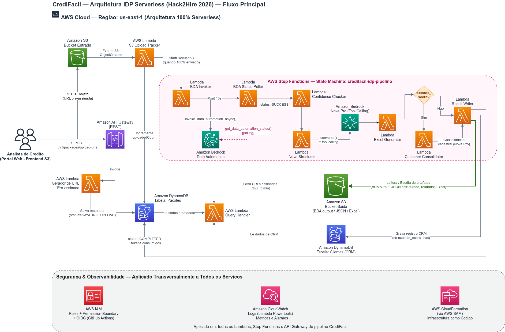

# 🏦 CrediFácil IDP


> Solução serverless de **Processamento Inteligente de Documentos (IDP)** para automação da análise de crédito com garantia imobiliária, construída de ponta a ponta na AWS com IA generativa.

Projeto desenvolvido para o **Hack2Hire 2026**, evento promovido pela **Escola da Nuvem** em parceria com a **AWS** — **Case A**.

---

## 📑 Sumário

- [Sobre o Evento](#-sobre-o-evento)
- [Equipe — Grupo 12](#-equipe--grupo-12)
- [O Desafio (Case A)](#-o-desafio-case-a)
- [A Solução](#-a-solução)
- [Arquitetura](#️-arquitetura)
- [Como Funciona](#️-como-funciona)
- [Impacto Mensurável](#-impacto-mensurável)
- [Estrutura do Repositório](#-estrutura-do-repositório)
- [Como Executar / Deploy](#-como-executar--deploy)
- [Segurança & Observabilidade](#-segurança--observabilidade)
- [Limitações Conhecidas](#️-limitações-conhecidas)
- [Roadmap / Melhorias Futuras](#️-roadmap--melhorias-futuras)
- [Estimativa de Custos](#-estimativa-de-custos)
- [Licença](#-licença)
- [Agradecimentos](#-agradecimentos)

---

## 🏆 Sobre o Evento

O **Hack2Hire** é um hackathon promovido pela **Escola da Nuvem** em parceria com a **AWS**, com o objetivo de conectar talentos a oportunidades de mercado através da resolução de desafios reais de negócio usando a nuvem AWS. Este repositório contém a solução desenvolvida pelo **Grupo 12** para o **Case A**.

## 👥 Equipe — Grupo 12

| Integrante |
|---|
| [Weriton Petreca](https://github.com/weritonpetreca) |
| [Mikael Kobama](https://github.com/Mikael-Kobama) |
| [Juan Levi](https://github.com/Juan92eng) |
| [Ítalo Palhares](https://github.com/ItaloPalhares) |

---

## 🎯 O Desafio (Case A)

A operação de crédito processa, diariamente, **centenas de solicitações de empréstimo com garantia imobiliária**, cada uma composta por múltiplos documentos (identidade, comprovante de renda, extrato bancário, matrícula do imóvel) que precisam ser analisados manualmente.

Essa dependência total de intervenção humana em todas as etapas gera:
- 🐌 Gargalo operacional e lentidão na resposta ao cliente;
- 💸 Aumento de custo por solicitação processada;
- 🔁 Retrabalho na conferência campo a campo;
- 📉 Limitação de escala da operação.

## 💡 A Solução

O **CrediFácil IDP** automatiza ponta a ponta a leitura, classificação, extração e consolidação dos documentos de um dossiê de crédito, usando serviços nativos de IA da AWS, entregando:

- Um **JSON estruturado e padronizado** com todos os dados extraídos do dossiê;
- Uma **planilha Excel consolidada**, pronta para auditoria humana;
- Opcionalmente, um **score de crédito** calculado por regra determinística, com classificação de risco e justificativa técnica.

O analista interage com tudo isso por uma única interface web, sem precisar abrir documento por documento.

---

## 🏗️ Arquitetura




A solução é **100% serverless**, na região `us-east-1`, dividida em duas frentes: o **fluxo principal** de processamento e uma camada transversal de **segurança e observabilidade**.

| Camada | Serviço AWS | Papel |
|---|---|---|
| Frontend | **Amazon S3** (Website Hosting) | Interface web estática (HTML/CSS/JS) |
| API | **Amazon API Gateway** (REST) | Ponto único de entrada HTTP |
| Ingestão | **AWS Lambda** | Geração de URLs pré-assinadas para upload direto |
| Armazenamento (entrada) | **Amazon S3** | Recebe os documentos originais via upload direto do navegador |
| Gatilho automático | **AWS Lambda** | Detecta upload completo e dispara o pipeline |
| Orquestração | **AWS Step Functions** | Máquina de estados `credifacil-idp-pipeline` |
| Extração (IDP) | **Amazon Bedrock Data Automation** | OCR, classificação e extração bruta por documento |
| Estruturação (IA) | **Amazon Bedrock — Nova Pro** | Estrutura os dados em JSON tipado (tool calling) |
| Consolidação (IA) | **Amazon Bedrock — Nova Pro** | Validação cruzada de KYC entre documentos |
| Regra de negócio | Código Python determinístico | Cálculo do score de crédito (auditável, não decidido pela IA) |
| Relatórios | **AWS Lambda** (openpyxl) | Geração de planilhas Excel estilizadas |
| Persistência | **Amazon DynamoDB** | Status do processamento + CRM consolidado do proponente |
| Armazenamento (saída) | **Amazon S3** | Resultados do BDA, JSON estruturado e planilhas |
| Consulta | **AWS Lambda** | Consulta de status e geração de URLs assinadas de download |
| Observabilidade | **AWS Lambda Powertools**, **Amazon CloudWatch**, **AWS X-Ray** | Logs estruturados, métricas e tracing distribuído |
| Segurança | **AWS IAM** (Roles + Permission Boundary) + **OIDC** | Privilégio mínimo, sem credenciais estáticas no CI/CD |
| IaC | **AWS SAM** / CloudFormation | Toda a infraestrutura é reprodutível via código |

## ⚙️ Como Funciona

1. **Upload:** o analista envia os documentos pela interface web → a API gera URLs pré-assinadas → o navegador faz o upload **direto para o S3**, sem passar pelo backend.
2. **Disparo automático:** quando todos os arquivos do lote chegam ao S3, uma Lambda detecta o evento e inicia automaticamente a execução do Step Functions.
3. **Extração:** o **Amazon Bedrock Data Automation** realiza o OCR e a classificação de cada documento.
4. **Estruturação:** o **Amazon Nova Pro** transforma a extração bruta em JSON estruturado e tipado, por documento.
5. **Score (opcional):** se solicitado, uma segunda chamada ao Nova Pro cruza os dados entre todos os documentos (consistência de nome, data de nascimento, documentos) e uma **regra determinística em código** calcula o score final (300 a 1000 pontos) com base em KYC, renda e liquidez.
6. **Persistência:** o resultado é salvo no **DynamoDB** e no **S3** (JSON + Excel).
7. **Consulta:** a interface consulta o status em tempo real e, ao concluir, exibe o relatório completo com links de download seguros (URLs assinadas).

## 📊 Impacto Mensurável

Em aproximadamente **2 minutos**, o CrediFácil IDP processa um pacote com **6 documentos distintos**, classifica cada arquivo e entrega os resultados em JSON estruturado e Excel — uma etapa que, manualmente, levaria entre **20 e 30 minutos** de triagem operador a operador.

Com a automação, o operador deixa de fazer a conferência campo a campo e passa a atuar de forma estratégica: revisando os dados já estruturados e sendo alertado apenas quando algum campo essencial não atingir um nível de confiabilidade adequado.

---

## 📁 Estrutura do Repositório

```
.
├── .github/workflows/         # Pipeline de CI/CD (GitHub Actions + OIDC)
│   └── deploy-dev.yml
├── events/                    # Eventos de exemplo para testes locais
├── frontend/                  # Interface web (HTML/CSS/JS)
│   ├── index.html
│   ├── app.js
│   └── style.css
├── infrastructure/
│   └── template.yaml          # Infraestrutura como código (AWS SAM)
├── samples/                   # Exemplos de payloads (ex.: baixa confiança do BDA)
├── src/
│   ├── lambdas/                # Uma pasta por função Lambda
│   │   ├── pre_signed_url/
│   │   ├── s3_upload_tracker/
│   │   ├── bda_invoker/
│   │   ├── bda_status_poller/
│   │   ├── confidence_checker/
│   │   ├── nova_structurer/
│   │   ├── excel_generator/
│   │   ├── customer_consolidator/
│   │   ├── result_writer/
│   │   ├── query_handler/
│   │   └── notification/
│   ├── layers/dependencies/    # Layer compartilhada (boto3, pydantic, powertools, openpyxl)
│   └── shared/                 # Modelos Pydantic, schemas JSON e tools do Bedrock
├── state_machines/
│   └── idp_pipeline.json       # Definição da máquina de estados
└── requirements.txt
```

## 🚀 Como Executar / Deploy

**Pré-requisitos:** AWS CLI configurado, [AWS SAM CLI](https://docs.aws.amazon.com/serverless-application-model/latest/developerguide/serverless-sam-cli-install.html), Python 3.12, acesso habilitado ao **Amazon Bedrock** (Data Automation + Nova Pro) na conta AWS de destino.

```bash
# Build da aplicação
sam build --template-file infrastructure/template.yaml

# Deploy (ambiente de desenvolvimento)
sam deploy \
  --stack-name credifacil-idp-dev \
  --resolve-s3 \
  --no-confirm-changeset \
  --parameter-overrides Environment=dev BdaProjectId=<SEU_BDA_PROJECT_ID> \
  --capabilities CAPABILITY_IAM CAPABILITY_AUTO_EXPAND
```

> O deploy contínuo está automatizado via **GitHub Actions** (`.github/workflows/deploy-dev.yml`), autenticando na AWS por **OIDC** — sem chaves de acesso estáticas armazenadas no repositório.

---

## 🔐 Segurança & Observabilidade

Aplicado de forma transversal a todas as Lambdas, ao Step Functions e à API Gateway:

- **AWS IAM** — roles com privilégio mínimo, escopadas por recurso, sob um *Permission Boundary* obrigatório do ambiente do hackathon;
- **OIDC (GitHub Actions)** — deploy sem credenciais de longa duração;
- **AWS X-Ray** — tracing distribuído ativo em todas as funções;
- **Amazon CloudWatch** — logs estruturados (AWS Lambda Powertools), métricas e alarmes;
- **Upload seguro** — arquivos só entram no S3 via URL pré-assinada de curta duração; downloads também são feitos via URLs assinadas, nunca por acesso público ao bucket.

## ⚠️ Limitações Conhecidas

- O fluxo de **notificação assíncrona (Amazon SNS)** e a **fila de revisão humana (Amazon SQS)** já estão desenhados na infraestrutura como código, mas **ainda não estão validados como funcionais** nesta fase do projeto. O pipeline de extração e cálculo de score funciona de ponta a ponta independentemente disso.
- Não há autenticação de usuários conectada à API neste MVP (o formato de claims do Cognito já está previsto nos eventos de exemplo, mas não está integrado ao código).
- O endpoint manual `/v1/packages/{packageId}/process` existe na infraestrutura mas não é utilizado pelo fluxo atual do frontend (o disparo é automático via evento de upload no S3).

## 🛣️ Roadmap / Melhorias Futuras

- 🔐 **Segurança e monitoramento ampliados:** integração de **AWS Shield** (proteção contra DDoS), **AWS WAF**, **Amazon GuardDuty** e **Amazon Cognito** (gerenciamento de usuários e senhas em escala);
- 📣 Correção e ativação completa da cadeia **Amazon SNS** (notificações) e **Amazon SQS** (fila de revisão humana);
- 🌐 **Amazon CloudFront** na frente do frontend e dos downloads (HTTPS customizado, cache, WAF);
- 🔄 Substituição do polling de status por **WebSocket API** ou **AWS AppSync** (atualização em tempo real);
- 🧩 Migração do disparo sequencial do BDA para um *Map state* nativo do Step Functions (paralelismo real, sem risco de timeout);
- ✅ Implementação de testes automatizados (`pytest` + `moto`);
- 💾 Habilitação de *Point-in-Time Recovery* (PITR) e backups automáticos no DynamoDB;
- 🔑 Criptografia customizada (KMS) em S3 e DynamoDB para uma postura de compliance mais forte.

## 💰 Estimativa de Custos

Considerando um cenário de aproximadamente **750 solicitações diárias**, foi realizada uma estimativa de custos com base nos serviços utilizados (Lambda, API Gateway, DynamoDB, S3, Bedrock, IAM, Step Functions e EventBridge).

🔗 [Confira a estimativa completa na Calculadora de Preços da AWS](https://calculator.aws/#/estimate?id=c0c37981b850386fe457dbaa52513264ab875d16)

---


## 🙏 Agradecimentos

À **Escola da Nuvem** e à **AWS** pela organização do Hack2Hire e pela oportunidade de aplicar serviços de nuvem e IA generativa em um desafio real de negócio.

---

<p align="center"><b>Grupo 12 — Hack2Hire 2026 — Case A</b></p>
